# WHAT is asm
ASM是一个java字节码操纵框架，它能被用来动态生成类或者增强既有类的功能。ASM 可以直接产生二进制 class 文件，也可以在类被加载入 Java 虚拟机之前动态改变类行为。Java class 被存储在严格格式定义的 .class文件里，这些类文件拥有足够的元数据来解析类中的所有元素：类名称、方法、属性以及 Java 字节码（指令）。ASM从类文件中读入信息后，能够改变类行为，分析类信息，甚至能够根据用户要求生成新类。

[下载地址]("http://asm.ow2.org/")

# Java class的结构
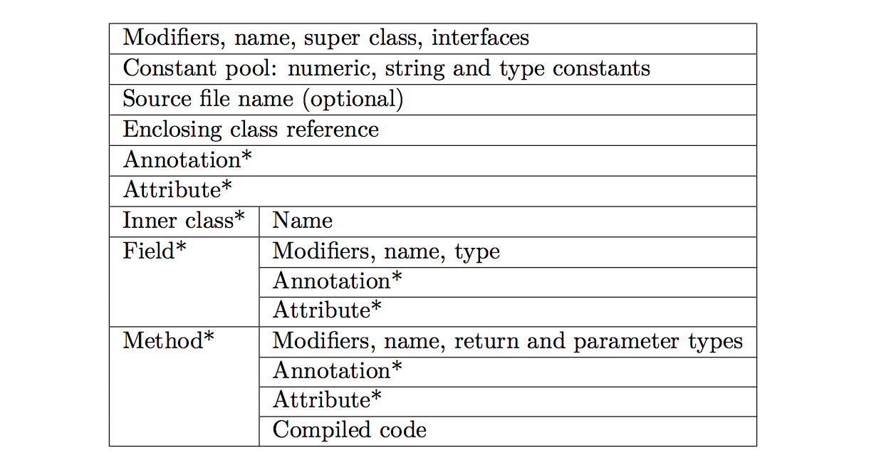

- 一个section描述modifiers（比如public, private),name, super class, interfaces, annotations

- 描述field的section，每个section描述modifiers，name
, type, annotations

- 描述方法和构造函数的section。每个section描述modifiers, name, parameter types以及annotations。其中它还包含方法的字节码。

源码文件和字节码文件有如下区别：

- 每个字节码文件都只有一个类，而源码可以包含多个类，其中主类文件包含多个指向内部类的引用。同样内部类也有主类的引用。

- 字节码文件不包含注释

- 字节码文件没有package和import部分，所以都是全类路径。

- 字节码文件含有一个常量池。

## 内部名称
一个类的内部名称是一个类的全路径，只不过点变成了斜杠，比如String就是java/lang/String。

## 类型描述

内部名仅用于描述类或接口类型，但是域，java类型是被描述为类型描述符的。

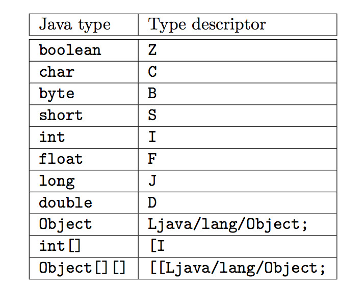

## 方法描述

方法描述用来描述方法的类型参数，返回类型。

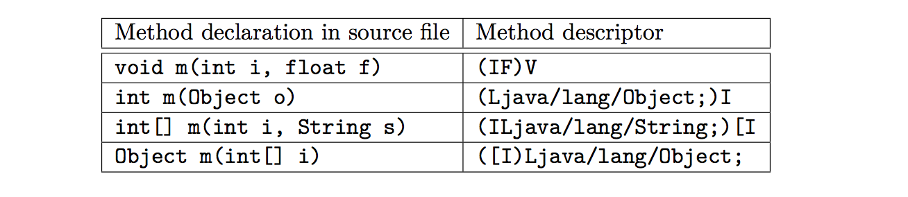

# ClassVisitor

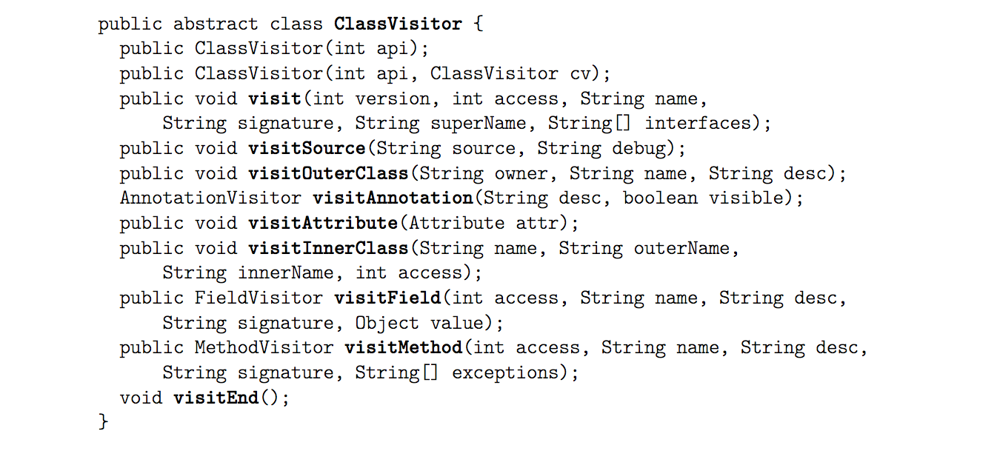

ASM使用ClassVisitor来生成以及转换一个编译过的类。

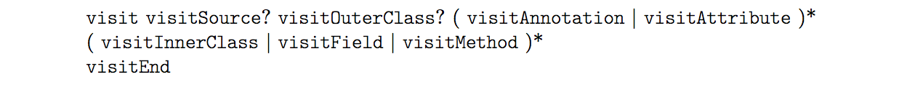

它的方法调用必须遵循以下的规则。
visit必须第一个掉，剩下的最多可以调用一次 visitSource，跟随着可以最多调用一次visitOuterClass。紧接着可以调用任意次数的visitAnnotation和visitAttribute。之后才是任意次数的visitInnerClass，visitField，visitMethod，并且以visitEnd结尾。

ASM提供了以下几个ClassVisitor的实现类:
- ClassReader

接受一个比特数组，用以用来分析一个class文件，并且有一个accept方法，接收ClassVisitor，它可以被视为一个时间产生者。

- ClassWriter

用来处理class的输出内容，可以被视为事件消费者。通过调用toByteArray输出class。

# 示例

```java
public class ClassPrinter extends ClassVisitor { 
    
    public ClassPrinter() {
          super(ASM4);
    }

    public void visit(int version, int access, String name, String signature, String superName, String[] interfaces) {
          System.out.println(name + " extends " + superName + " {");
    }
    
    public void visitSource(String source, String debug) {
    
    }
    
    public void visitOuterClass(String owner, String name, String desc) {
        
    }
    
    public AnnotationVisitor visitAnnotation(String desc, boolean visible) {
                return null;
    }

    public void visitAttribute(Attribute attr) {
    
    }
    
    public void visitInnerClass(String name, String outerName, String innerName, int access) {
    
    }

    public FieldVisitor visitField(int access, String name, String desc, String signature, Object value){
        System.out.println("    " + desc + " " + name);
        return null;
    }

    public MethodVisitor visitMethod(int access, String name, String desc, String signature, String[] exceptions) {
        System.out.println("    " + name + desc);
        return null;
    }
        
    public void visitEnd() {
        System.out.println("}");
    } 
}
```

```java
ClassPrinter cp = new ClassPrinter();
ClassReader cr = new ClassReader("java.lang.Runnable");
cr.accept(cp, 0);
```

```shell
java/lang/Runnable extends java/lang/Object {
          run()V
}
```

# 进阶

## 修改class文件的版本号

之前我们都是单独使用ClassReader或者ClassWriter，现在我们尝试把他们组合在一起使用，这也就是如何使用ASM转换一个类的方法。

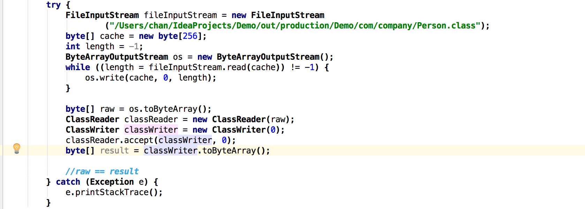

在这个例子中，raw和result中的内容其实是一样的都是同一个class。

之前提到ClassVisitor可以作为ClassWriter和ClassReader的事件过滤器，我们看下如何使用
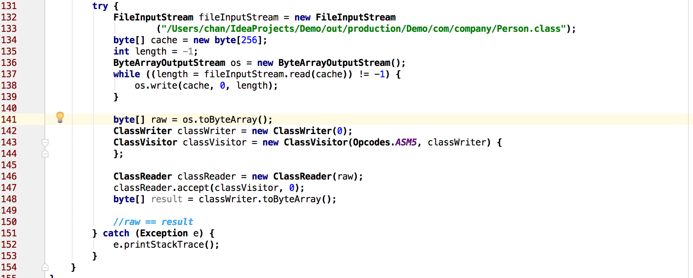

在这个例子里，raw 和result还是同一个class。但是实现方式却不同了，它更像是


classVisitor的角色就像是Adapter，它处理这所有从reader发送过来的事件并且转发给writer。不过因为没有过滤任何事件，所以最终产物是不变的。
但是我们可以尝试做一些过滤：
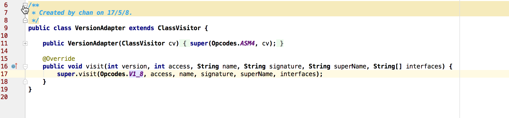
在这里，事件还是和之前一样，都是发送到writer，出了visit，在visit里，我们修改了class的版本号到java8，所以现在更像是：


### 优化
在之前的例子中，我们只是修改了下class的版本号，但却把整个class文件解析了，这是非常没有效率的一件事。所以，我们应该竟可能的优化我们的代码，比如，我们只解析需要修改的部分，而不是所有部分都解析。

在ASM里，有这样一个优化规则：
1. 如果ClassReader察觉到一个MethodVisitor是被一个ClassVisitor返回的，并且这个ClassVisitor是经过他的accept方法传进来的，那么，如果这个ClassVisitor还代理了一个ClassWriter，那么这就意味着，这个方法的内容将不会被转换，所以应用也不会察觉到。
2. 在刚刚说的case下，ClassReader不会解析这个方法的内容，也不会生成相应的事件，而只是拷贝这个方法的字节数组。

要满足以上的优化规则，我们只需要让ClassReader和ClassWriter互相引用彼此就可以了。

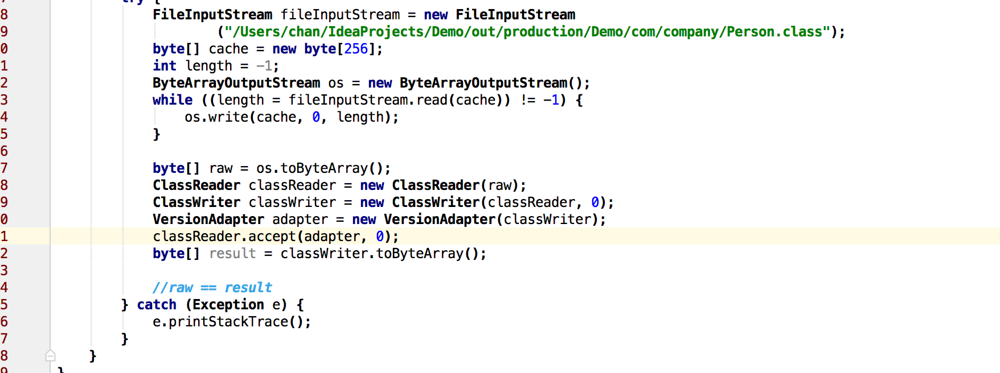

## 增加类成员

当你想要增加成员的时候，你只需要调用对应的visitField方法，不过要注意调用顺序：


你不能再visit里面调用visitField，因为之后可能跟着调用visitSource,这是非法的。同样你不能再visitSource/OuterClass/Annotation/Attribute里面调用，所以可能的地方只有visitInnerClass/Field/Method/End。

如果你把visitField放在visitEnd里面，他将会必定被调用，因为visitEnd是必定被调用的。如果你放在visitInnerClass/Field/Method里，他们可能会被多次调用，所以你必须要采用一些策略来保证只会添加同一个成员一次。

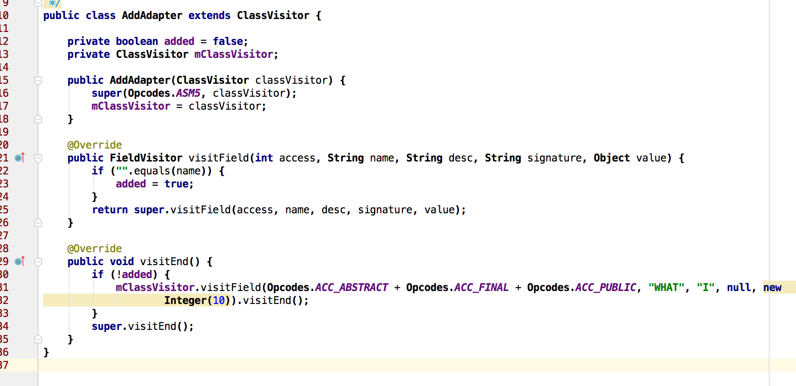

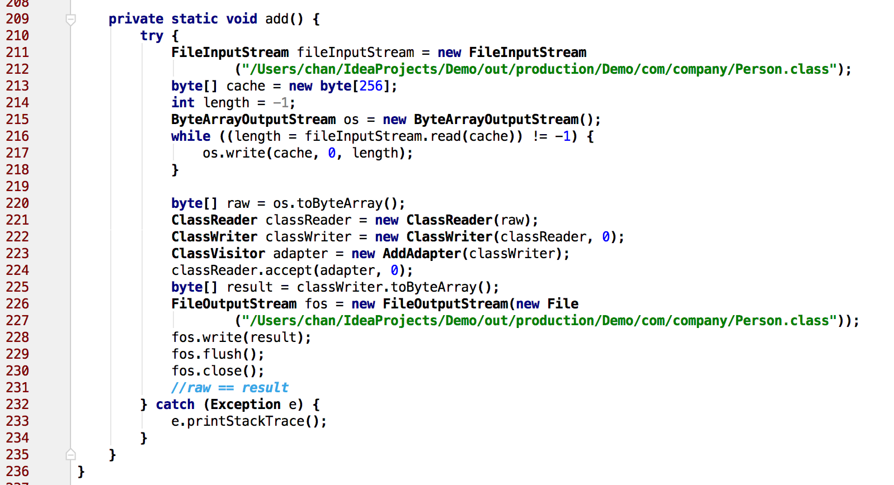
