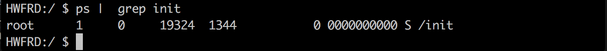

# 常见的投屏方案

1. View.getDrawingCache()

这是最常见的应用内截屏方法，这个函数的原理就是通过view的Cache来获取一个bitmap对象，然后保存成图片文件，这种截屏方式非常的简单，但是局限行也很明显，首先它只能截取应用内部的界面，甚至连状态栏都不能截取到。其次是对某些view的兼容性也不好，比如webview内的内容也无法截取。

2. 读取/dev/graphics/fb0

因为Android是基于linux内核，所以我们也能在android中找到framebuffer这个设备，我们可以通过读/dev/graphics/fb0这个帧缓存文件中的数据来获取屏幕上的内容，但是这个文件是system权限的，所以只有通过root才能读取到其中的内容，并且直接通过framebuffer读取出来的画面还需要转换成rgb才能正常显示。

3. 反射调用SurfaceControl.screenshot()或者Surface.screenshot()

SurfaceControl.screenshot()(低版本是Surface.screenshot())是系统内部提供的截屏函数，但是这个函数是@hide的，所以无法直接调用，需要反射调用，并且如果是用户进程，即使是反射也拿不到数据。

4. screencap -p xxx.png/screenshot xxx.png

这两个是在shell下调用的命令，通过adb shell可以直接截图。

5. MediaProjection,VirtualDisplay (version >= 5.0)

在5.0以后，google开放了截屏的接口，可以通过”虚拟屏幕”来录制和截取屏幕，不过因为这种方式会弹出确认对话框，并且只在5.0上有效。

# 投屏方案的选择

vysor选择的是三种方案，通过分析源码得知，vysor通过发射调用SurfaceControl.screenshot()或者Surface.screenshot(), 但是，如果是用户进程，即使发射了也是拿不到数据的，这时候就需要提权，如果能够拿到system权限，那么就可以很轻松的获取到数据，并且也不需要做什么特殊的处理，直接将拿到的图片发送给web端显示就可以了。我们的实现是通过app_proces，它是拥有system权限的。追溯其父进程它是init。



# 实现

1. 通过运行god.sh执行
```shell
export CLASSPATH=/data/app/$package-1/base.apk;exec app_process /system/bin com.shanbay.beaver.server.Main $width $height
```

其中CLASSPATH指定类加载路径，exec执行app_process（system/bin目录下）

2. app_process运行纯java代码：
创建web socket服务器
```java
WebSocketServer webSocketServer = new BeaverServer(new InetSocketAddress(WEB_LISTEN_PORT));
            webSocketServer.start();
```

3. port转发
在android上如果创建套接字服务器的话，端口是不能被外界感知的，也就是说在一个局域网里，即使android客户端有54321这个服务器端口外部也不能访问。这时候需要通过adb对端口进行转发：
```shell
adb forward tcp:56789 tcp:56789
```
adb指定对android端56789端口的访问都转换到pc的56789端口

4. web端连接服务器
```javascript
//1. 指定websocket连接的地址
var ws = new WebSocket('ws://localhost:56789');
```

5. 发送截图
```java
//1. hook api
if (Build.VERSION.SDK_INT <= 17) {
    mSurfaceName = "android.view.Surface";
} else {
    mSurfaceName = "android.view.SurfaceControl";
}
//2. 获取bitmap
Bitmap bitmap = (Bitmap) Class.forName(mSurfaceName)
                                .getDeclaredMethod("screenshot", new Class[]{Integer.TYPE, Integer.TYPE})
                                .invoke(null, sPictureWidth, sPictureHeight);
//3. 对图片做旋转处理
Matrix matrix = new Matrix();
matrix.setRotate(sRotate);
Bitmap resultBitmap = Bitmap.createBitmap(bitmap, 0, 0, bitmap.getWidth(), bitmap.getHeight(), matrix, false);

//4. 设置流头部                        
ByteArrayOutputStream out = new ByteArrayOutputStream();
out.write(new byte[]{CODE_IMAGE});

//5. 写回客户端
resultBitmap.compress(Bitmap.CompressFormat.JPEG, 100, out);                    
byte[] data = out.toByteArray();
synchronized (mWebSockets) {
    for (WebSocket webSocket : mWebSockets) {
        webSocket.send(data);
    }
}
```

6. 客户端显示
```javascript
//读取二进制数据
ws.onmessage = function(event) {
	var fileReader = new FileReader();
	fileReader.onload = function() {
		var result = new Uint8Array(this.result);
		var type = result[0];
		var data = event.data.slice(1, event.data.size);
		if (type == CODE_IMAGE) {
			//根据头部判断类型
			handleImage(data);
		} else if (type == CODE_CHECK_POINT) {
			handleCheckPoint(data);
		}
	}
	fileReader.readAsArrayBuffer(event.data);
	fileReader.result;
};
//html5 canvas绘制
var blob  = new Blob([data], {type: "image/jpg"});
var img = new Image();
img.onload = function (e) {
    ctx.drawImage(img, 0, 0);
    window.URL.revokeObjectURL(img.src);    
	img = null;
};
img.onerror = img.onabort = function (e) {    
	img = null;
};
img.src = window.URL.createObjectURL(blob);
```

7. 客户端回传点击事件
```javascript
//1. 注册鼠标事件
screen.addEventListener('mousedown', down, false);
screen.addEventListener('mouseup', up, false);
screen.addEventListener('mousemove', move, false);


//2. 回传
var x = event.pageX - screen.offsetLeft;
var y = event.pageY - screen.offsetTop;
var lastX = x;
var lastY = y;
 	
var json = '{"type": ' + type + ', "data": { "x": ' + lastX + ', "y": ' + lastY + '}}'
ws.send(json);
```

8. Android模拟点击
```java
//1. hook input manager
sInputManager = (InputManager)InputManager.class.getDeclaredMethod("getInstance").invoke(null);
sMode = (int) InputManager.class.getDeclaredField("INJECT_INPUT_EVENT_MODE_ASYNC").get(null);
sInjectInputEventMethod = InputManager.class.getMethod("injectInputEvent", InputEvent.class, Integer.TYPE);

//2. 换算成屏幕坐标
float x = motionProtocolMessage.data.x * (sScreenWidth / sPictureWidth);
float y = motionProtocolMessage.data.y * (sScreenHeight / sPictureHeight);

//3. 模拟点击
injectMotionEvent(InputDeviceCompat.SOURCE_TOUCHSCREEN, MotionEvent.ACTION_MOVE, SystemClock.uptimeMillis(), x, y, 1.0f);

//4. 构造Event
MotionEvent event = MotionEvent.obtain(when, SystemClock.uptimeMillis(), action, x, y, pressure, 1.0f, 0, 1.0f, 1.0f, 0, 0);
event.setSource(inputSource);
sInjectInputEventMethod.invoke(sInputManager, event, sMode);
event.recycle();
```